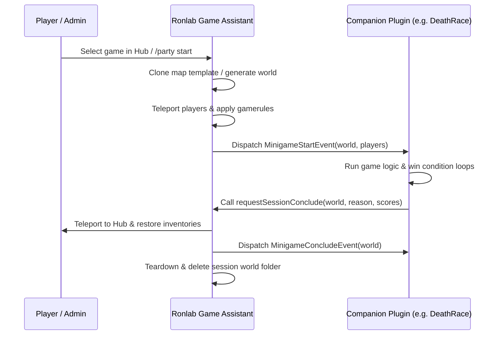

# Companion Plugin Migration Kit (CPMK) — Architecture Guide

> [!NOTE]
> This guide outlines the event-driven lifecycle and architecture for building lightweight companion minigames powered by Ronlab Game Assistant (RGA).

---

## 1. Architectural Overview

Companion plugins delegate heavy server infrastructure responsibilities to RGA:

---

## 2. Shared Responsibilities Matrix

| Functionality | Handled By | RGA Mechanism |
| :--- | :--- | :--- |
| World Generation / Cloning | **RGA** | `WorldCopyManager` async template copy |
| Inventory Clear / Save / Restore | **RGA** | `InventoryManager` world groups & Hub snapshots |
| Player Teleportation to/from Hub | **RGA** | `HubListener` & `SessionManager` |
| Disconnect & Orphan Recovery | **RGA** | `SessionManager` write-ahead state logs |
| Game Rules & Win Conditions | **Companion Plugin** | Custom listeners & task runnables |
| Leaderboards / Victory Messages | **Companion Plugin** | Adventure API text components |

---

## 3. Best Practices & Safety Guidelines

1. **Decoupled API Imports**: Import `com.ronlab.rga.api.*` for event structures and key models.
2. **Pure Model Identifiers**: Use `MinigameId.of("yourgame")` for lightweight, offline-testable key identifiers.
3. **Graceful Degradation**: Always verify `RGA.getInstance() != null` during plugin enable.
